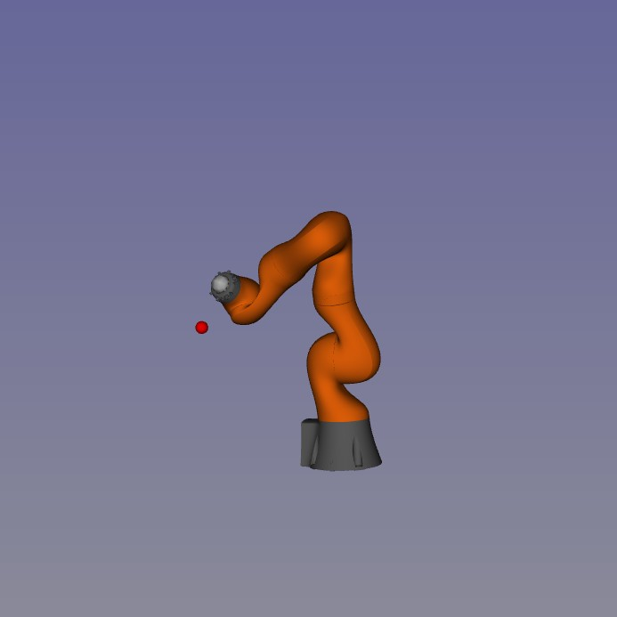

# A Supervised Approach to Reinforcement Learning
Deep reinforcement learning (RL) often relies on simulators as abstract oracles to model interactions within complex environments. While differentiable simulators have recently emerged for multi-body robotic systems, they remain underutilized, despite their potential to provide richer information. This underutilization, coupled with the high computational cost of exploration-exploitation in high-dimensional state spaces, limits the practical application of RL in real-world. We propose a method that integrates learning with differentiable simulators to enhance the efficiency of exploration-exploitation. Our approach learns value functions, state trajectories, and control policies from locally optimal runs of a model-based trajectory optimizer. The learned value function acts as a proxy to shorten the preview horizon, while approximated state and control policies guide the trajectory optimization. We benchmark our algorithm on three classical control problems and a torque-controlled 7 degree-of-freedom robot manipulator arm, demonstrating faster convergence and a more efficient symbiotic relationship between learning and simulation for end-to-end training of complex, poly-articulated systems.


The source code is released under the [MIT license](LICENSE).


**Authors:** [Amit Parag](https://scholar.google.com/citations?user=wsRIfL4AAAAJ&hl=en&oi=ao) <br />

<br /> 

  

<br /> 

The algorithm is implemented on the Kuka arm. The goal is to reach for the static target.
<br /> 
<br /> 
## Required Packages:
The Unsual Suspects
* [PyTorch](https://pytorch.org/)
* [Crocoddyl](https://github.com/loco-3d/crocoddyl)
* [Pinocchio](https://github.com/stack-of-tasks/pinocchio)
* [example-robot-data](https://github.com/gepetto/example-robot-data)
* [Gepetto Gui](https://github.com/Gepetto/gepetto-viewer-corba) (optional for animating the learned policy in GUI)

The Usual Suspects
* [Numpy](https://numpy.org/)
* [tqdm](https://github.com/tqdm/tqdm)
* [Seaborn](https://seaborn.pydata.org/)
* [Matplotlib](https://matplotlib.org/)
* [PyYaml](https://pypi.org/project/PyYAML/)
* [jupyter](https://jupyter.org/) (optional for notebooks)
<br /> 

## How to run the experiment

Clone the repo
```
git clone https://gitlab.laas.fr/aparag/kuka-arm-dpvp
```


Change directory to src

```
cd dpvp/src

```

Look at the exp.yml file for experiment params.

 Then run the main.py file
```
python3 main.py
```

The trained NN will be saved in `results/exp_`

The directory `config/robot_properties_kuka` contains URDF and meshes information of the robot, and `config/ocp_params` contains sets of robot parameters describing the OCP for Crocoddyl. The OCP itself is setup in `utils/ddp.py`

<br>


